<!-- markdownlint-disable MD033 MD041 -->
<p align="center">
  
</p>

<h1 align="center">Sill</h1>

<p align="center">
  <strong>Press one key, type what you want, and it happens.</strong>
</p>

<p align="center">
  An open-source command palette for Windows. Apps, files, settings,
  clipboard history, snippets, window control, on-device speech to text
  and AI, from one search field. Runs Raycast extensions.
</p>

<p align="center">
  <a href="https://github.com/winters27/Sill/actions/workflows/verify.yml"></a>
  <a href="https://github.com/winters27/Sill/releases"></a>
  <a href="https://github.com/winters27/Sill/releases"></a>
  <a href="LICENSE"></a>
  <a href="https://github.com/winters27/Sill/stargazers"></a>
  
</p>

<p align="center">
  <a href="https://github.com/winters27/Sill/releases/latest">Download</a>
  &nbsp;·&nbsp;
  <a href="docs/guide.md">Guide</a>
  &nbsp;·&nbsp;
  <a href="docs/extensions.md">Extensions</a>
  &nbsp;·&nbsp;
  <a href="docs/mcp.md">MCP</a>
  &nbsp;·&nbsp;
  <a href="docs/benchmark.md">What it costs</a>
</p>

<p align="center">
  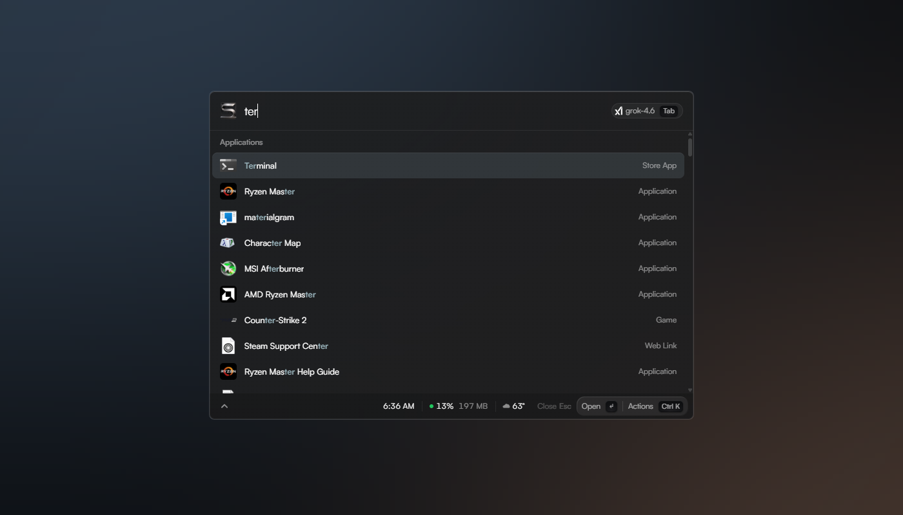
</p>

Sill is a launcher, the kind of program that lives behind one key. Press it
and a search field appears over whatever you were doing. Type a few letters
and it finds the program, file, setting, window, snippet or switch you meant,
ranked by what you actually open. Press Enter and it does the obvious thing.
Press Escape and it is gone.

It is written in Rust with a Svelte interface, so it starts fast, stays small,
and costs close to nothing while it waits. It runs on Windows 11 and is MIT
licensed.

## What it does

<table>
  <tr>
    <td width="50%" valign="top">
      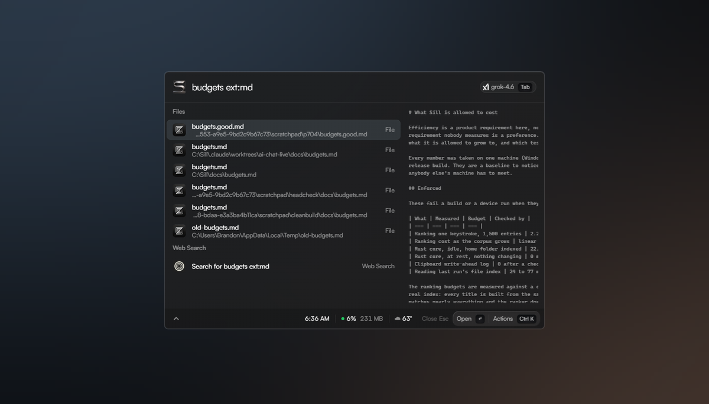
      <p><b>Search, then act.</b> Start Menu apps, Windows settings pages,
      files, open windows, emoji and the machine's own switches, all from one
      field. <code>ext:md</code>, <code>size:>1mb</code> and
      <code>date:week</code> narrow a file search, and the file under the
      cursor shows what is inside it. Every result is a typed thing with its
      own actions: a file can be renamed, moved or hashed, a window sent to a
      half or a quarter of the screen.</p>
    </td>
    <td width="50%" valign="top">
      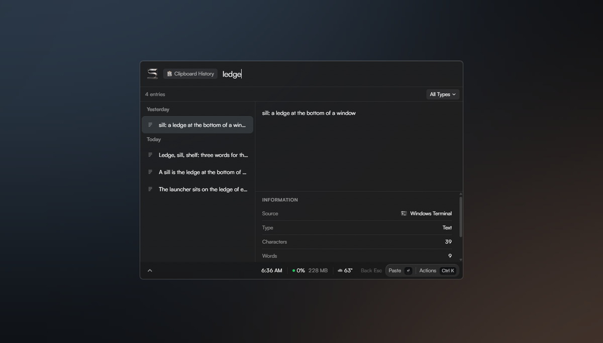
      <p><b>Everything you have copied.</b> Text, images and files, with the
      program each came from, searchable by content. Pin what should stay,
      exclude programs whose output should never be kept, and set how long the
      rest lives. What a password manager marks confidential is never
      recorded, and neither is anything that looks like a secret.</p>
    </td>
  </tr>
  <tr>
    <td width="50%" valign="top">
      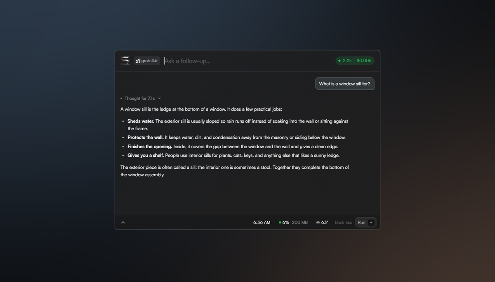
      <p><b>Ask, right there.</b> Type a question and press Tab instead of
      Enter. The answer appears in place, and Escape brings the search back
      with your words still in it. A chat window with a sidebar, attachments
      and formatted answers is one row away.</p>
    </td>
    <td width="50%" valign="top">
      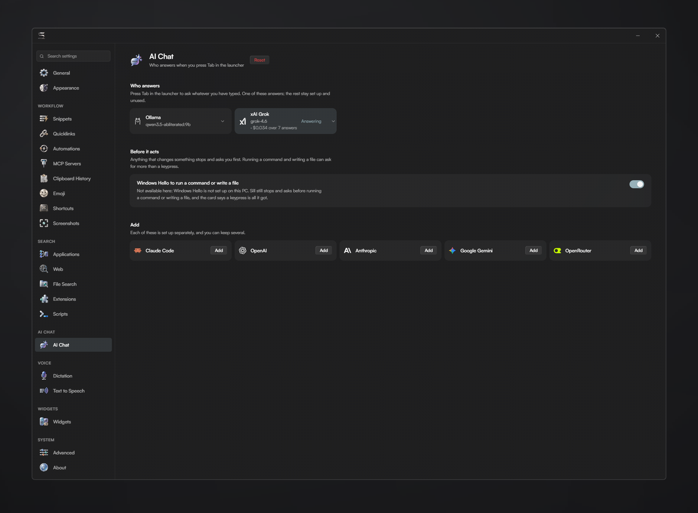
      <p><b>Bring the model you already pay for.</b> OpenAI, Anthropic,
      Google, xAI, Groq, OpenRouter, a local Ollama, or the Claude Code CLI on
      your subscription. Keys are sealed by Windows rather than left in a
      settings file. The model can read the index, files, the clipboard, your
      windows and the screen; anything that would change the machine stops at
      a card and waits for a yes.</p>
    </td>
  </tr>
  <tr>
    <td width="50%" valign="top">
      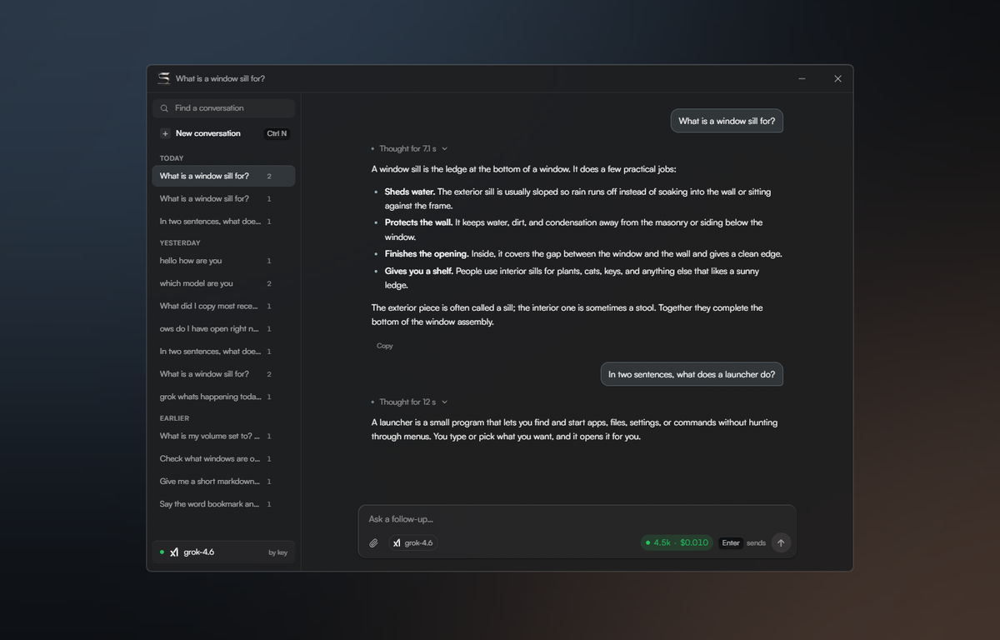
      <p><b>A room to think in.</b> The same model, in a window with your
      conversations down the side, attachments, and answers that arrive as you
      read them. It can see what is on this machine when you ask it to: the
      index, a file, the clipboard, your open windows. What it spent is on the
      composer, per answer, so the bill is never a surprise.</p>
    </td>
    <td width="50%" valign="top">
      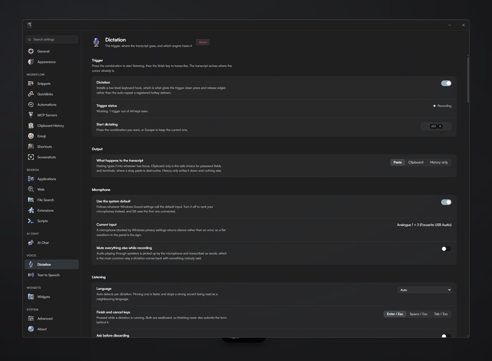
      <p><b>Speak instead of typing.</b> Hold a key, talk, let go, and the
      words land where the cursor already is. Transcription runs on this
      machine with whisper.cpp, so nothing you say leaves it. Prefer a cloud
      service? Point it at OpenAI, Groq or any compatible endpoint instead.
      Vocabulary, statistics and a transcript history live in Settings.</p>
    </td>
  </tr>
  <tr>
    <td width="50%" valign="top">
      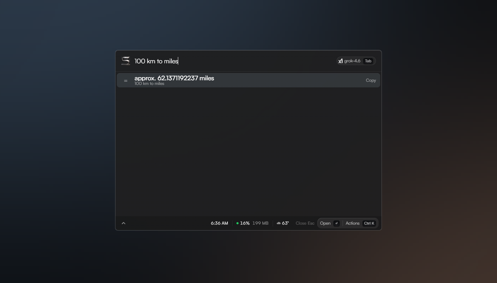
      <p><b>Sums, units, dates.</b> <code>100 km to miles</code>,
      <code>2 GB to MB</code>, <code>0xff + 1</code>. The answer sits at the
      top of the list and Enter copies it. A version number is not a sum, and
      the calculator is careful enough to know the difference.</p>
    </td>
    <td width="50%" valign="top">
      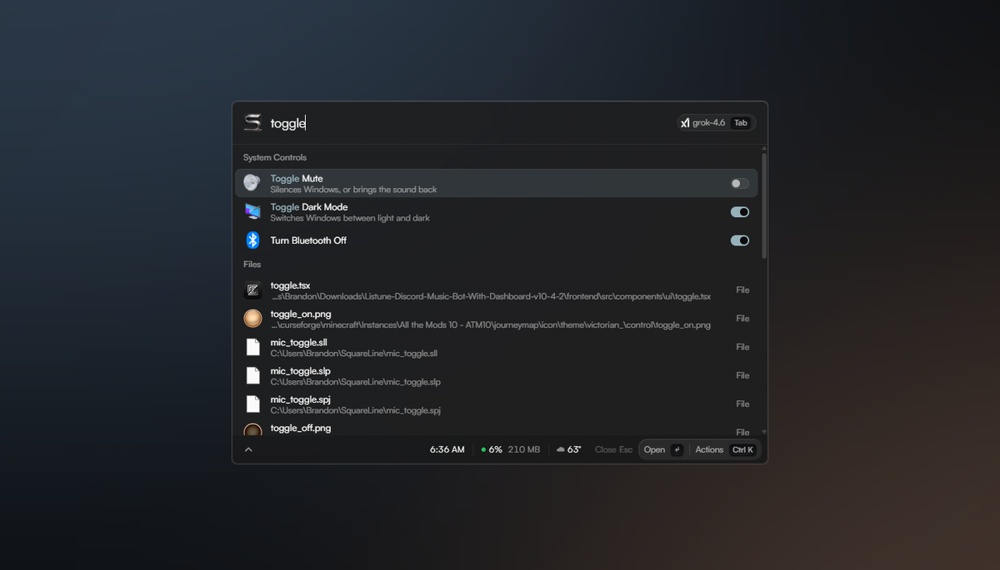
      <p><b>The machine's own switches.</b> Dark mode, Wi-Fi, Bluetooth,
      volume, one program's volume on its own, which speakers sound comes out
      of. Each is a row you press without leaving the launcher, drawn as a
      switch that shows which way it is set.</p>
    </td>
  </tr>
  <tr>
    <td width="50%" valign="top">
      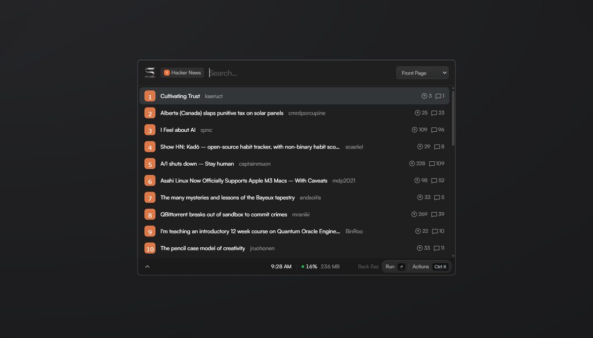
      <p><b>Raycast extensions, on Windows.</b> Browse the store from inside
      Sill and install with Enter. They draw with the launcher's own rows,
      icons and keys, so an extension looks like part of the program rather
      than a window inside it.</p>
    </td>
    <td width="50%" valign="top">
      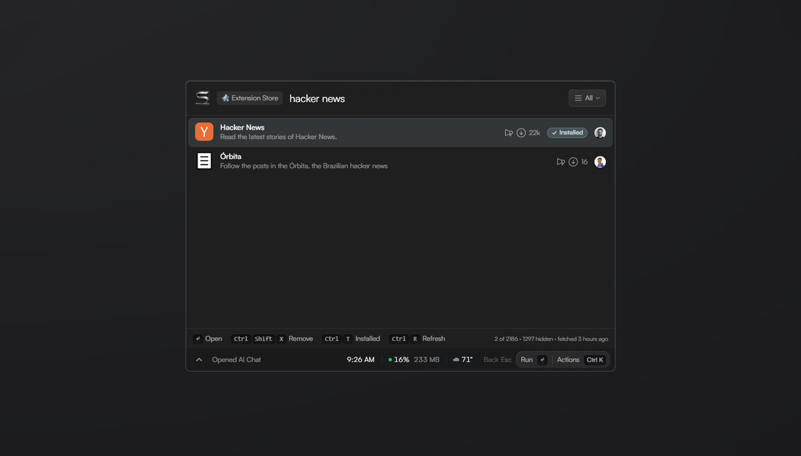
      <p><b>A store, in the search field.</b> Every published extension,
      searchable where you already are, with what each one costs to install and
      whether you have it. Enter fetches it and it is a command a keystroke
      later. No browser, no download folder, no restart.</p>
    </td>
  </tr>
  <tr>
    <td width="50%" valign="top">
      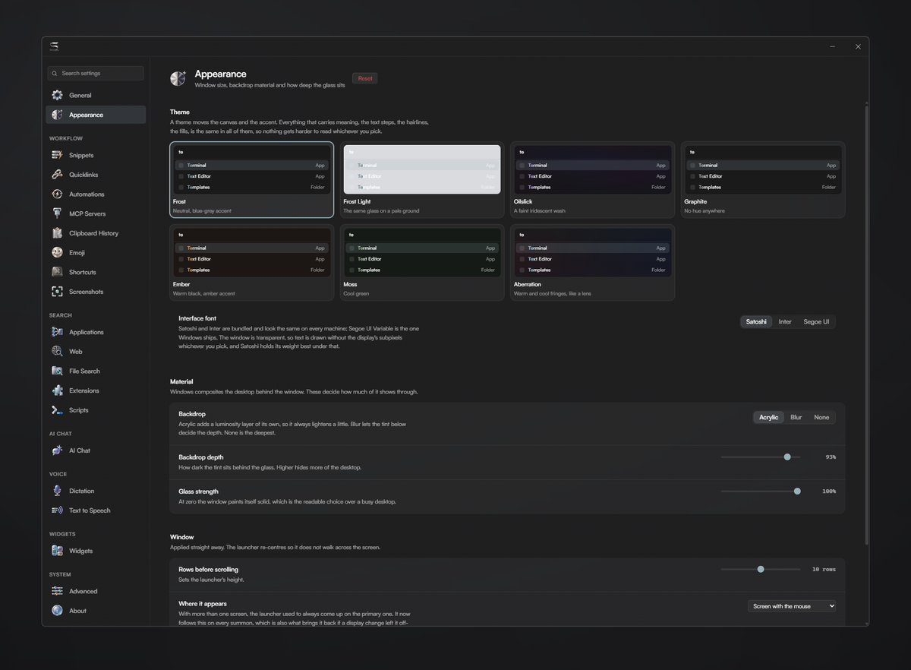
      <p><b>Glass, seven ways.</b> The window is transparent and the desktop
      shows through it. Themes change the tint and the accent and nothing
      else, so every one of them is as readable as the last. Snippets,
      quicklinks, web search, reminders, workspaces, screenshots with a markup
      editor, text read off the screen, and text read aloud are all in there
      too.</p>
    </td>
    <td width="50%" valign="top">
      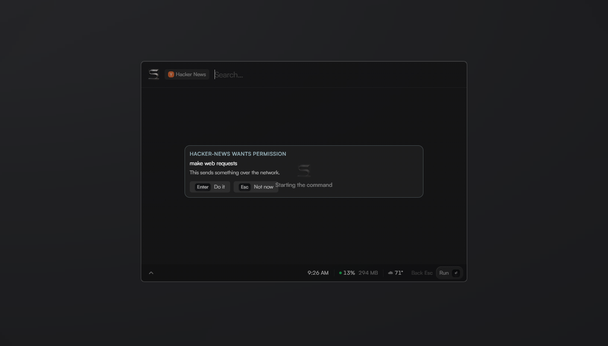
      <p><b>Nothing is granted quietly.</b> An extension starts with the right
      to draw in the launcher and nothing else. Files, the network and other
      programs are each asked for the first time it reaches for one, in a card
      that names what it wants and waits. Every answer is revocable in
      Settings. The same card stands in front of anything the model does that
      would change the machine.</p>
    </td>
  </tr>
</table>

## What it costs

A launcher is open all day, so what it costs while doing nothing is the whole
question. Sill is meant to be almost free at rest, and that is a claim about
numbers rather than a feeling. Every reading, with the machine, the build and
the day it was taken, is on one page that is generated from the measuring
scripts and cannot be edited by hand: [docs/benchmark.md](docs/benchmark.md).
The same page carries the command that takes each reading on your own machine.

## Install

**[Download the latest release](https://github.com/winters27/Sill/releases/latest)**
for Windows 11. Run the installer, press **Alt+Space**, and start typing.
Everything is optional after that; file search across the whole disk gets
faster with [Everything](https://www.voidtools.com/) installed, and Sill
offers to fetch it.

To build it yourself, with the
[Tauri 2 prerequisites](https://v2.tauri.app/start/prerequisites/), Rust
stable and Node 20 or newer:

```bash
npm install
npm run host:build
npm run tauri dev
```

`npm install` also fetches the interface font, which is not open source and
travels per machine rather than in the repository.
[docs/developing.md](docs/developing.md) has the rest: verifying, releasing,
signing, and how the pictures on this page are taken.

## Extend it

Four ways in, and every one of them lands in the same action registry as a
keypress.

**A Raycast extension**, from the store or a folder on disk. The API coverage
table is in [docs/extensions.md](docs/extensions.md).

**A script** with a Raycast-style header, in PowerShell, cmd, bash, Python or
a bare executable. It is found by search and its arguments are asked for one
at a time:

```powershell
# @raycast.schemaVersion 1
# @raycast.title Empty Downloads
# @raycast.mode silent
Remove-Item "$env:USERPROFILE\Downloads\*" -Recurse
```

**An MCP server** you already run. Paste its command line in Settings, press
Check, and its tools appear beside Sill's own in the action panel.
[docs/mcp.md](docs/mcp.md) covers what one costs.

**A link or a command line.** Both stop at a card that names the action and
the target before anything happens:

```text
sill://run/sill.launch?target=C:\Users\me\Notes
sill run sill.file.recycle C:\Users\me\old.txt
```

## Read more

| Page | What it is for |
| --- | --- |
| [Using Sill](docs/guide.md) | The guide for somebody with it open |
| [Writing an extension](docs/extensions.md) | The Raycast API, name by name, and Sill's own |
| [MCP servers](docs/mcp.md) | Putting a server you have into the action panel |
| [What it costs](docs/benchmark.md) | Every measured reading, and the budgets in [budgets.md](docs/budgets.md) |
| [Developing](docs/developing.md) | Building, verifying, releasing |
| [Changelog](CHANGELOG.md) | What changed, said the way you would notice it |

The keyboard reference is not written down anywhere. Press `?` in the
launcher with an empty field and Sill builds it from the keys that are
actually registered, including your own changes.

## Star history

<a href="https://star-history.com/#winters27/Sill&Date">
  
</a>

Issues and pull requests are welcome. Read
[docs/developing.md](docs/developing.md) first; `npm run verify` is what a
change has to pass.

## Licence

MIT. See [LICENSE](LICENSE). Three third-party works travel with this project
under their own terms, and [resources/NOTICE](resources/NOTICE) names each: a
Windows settings catalogue from Microsoft PowerToys, the marks and menu glyphs
from Phosphor Icons, and the Satoshi typeface from Indian Type Foundry.

<p align="center"><sub><i>Made by Winters.</i></sub></p>
